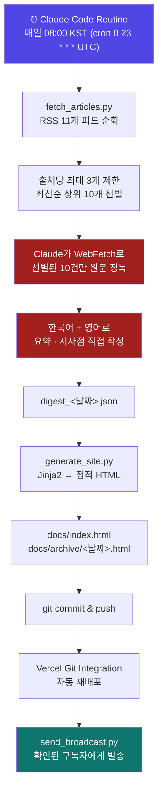
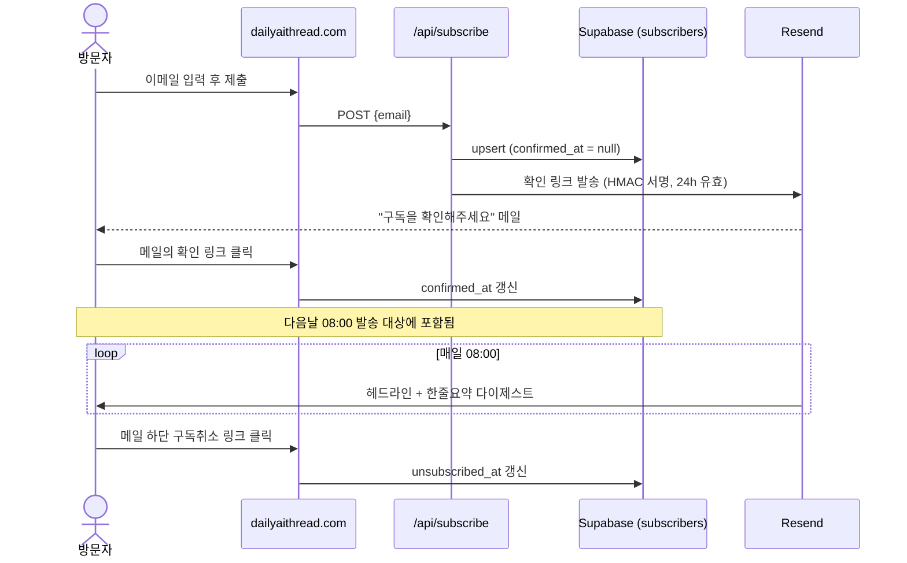
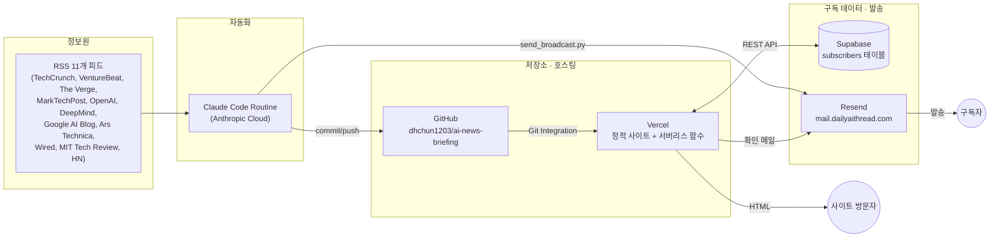

# AI News Briefing — 프로젝트 개요

`dailyaithread.com` — AI 관련 기사를 매일 자동으로 수집·해석해 정적 웹페이지와 이메일로
전달하는 완전 자동화 파이프라인. 기획 배경부터 개발 과정, 최종 배포 아키텍처까지를
정리한 문서다. 설계 판단의 세부 근거는 [`PLAN.md`](PLAN.md), 운영 방법은
[`README.md`](README.md)를 참고.

## 1. 기획

### 목표
사람 개입 없이 **매일 아침 8시(KST)** 에:
1. AI 뉴스 RSS 피드들을 순회해 출처 다양성을 지키며 상위 10개 기사를 선별하고,
2. 선별된 기사만 Claude가 직접 원문을 읽어 한국어·영어로 요약과 "시사하는 점"을 작성하고,
3. 정적 웹페이지로 발행하고,
4. 이메일 구독자에게 헤드라인 다이제스트를 발송한다.

### 설계 원칙
자매 프로젝트 `business-trend-briefing`에서 이어받은 핵심 철학:

> **수집·생성은 스크립트로 싸게, 해석은 선별된 것만 Claude가 비싸게.**

RSS 수집(수백 건)과 HTML 생성은 결정론적 스크립트가 담당하고, "이 기사가 왜 중요한가"라는
판단이 필요한 부분만 Claude가 개입한다. 전체 피드를 다 원문 fetch하지 않고 스크립트가
10개로 좁혀놓은 뒤에만 Claude가 원문을 정독하는 2단계 구조로 비용을 통제했다.

### 초기 의사결정
| 항목 | 선택 | 이유 |
|---|---|---|
| 기사 수집 | RSS 직접 파싱 | AI 뉴스는 전용 API가 거의 없고 RSS는 무료·무인증 |
| 배포 | GitHub Pages → **Vercel로 전환** | 이 환경에 `gh` CLI가 없어 GitHub Pages를 API로 활성화할 수 없었음. Vercel은 대시보드 연결만으로 충분 |
| 스케줄링 | Claude Code Routines | `/loop`·`CronCreate`는 임시 작업이라 만료됨. Routine은 영구 cron |

## 2. 파이프라인 시각화

### 2-1. 매일 자동 실행되는 콘텐츠 파이프라인

빨간색 두 단계(원문 정독, 요약·시사점 작성)만 Claude의 판단이 개입하고, 나머지는 전부
결정론적 스크립트/플랫폼 자동화다.

### 2-2. 이메일 구독 흐름 (일일 파이프라인과 별개, 방문자가 언제든 트리거)

확인/구독취소 토큰은 별도 저장소 없이 `email + 만료시각`을 서버 비밀키로 HMAC-SHA256
서명해 링크에 담는다 — 클릭 시 서명을 재계산해 비교하는 것만으로 검증이 끝난다.

### 2-3. 전체 시스템 아키텍처 (관련 서비스)

## 3. 개발 단계

### Phase 1 — 스캐폴딩
- RSS 피드 후보를 WebFetch/curl로 전수 검증 (11개 확정, Anthropic 공식 RSS 부재로 제외)
- `fetch_articles.py`(수집), `generate_site.py`(생성), Jinja2 템플릿, 기본 CSS 작성
- GitHub 저장소 연결, 최초 커밋/푸시
- **Vercel로 배포 전환** — GitHub Pages 대신 선택 (근거는 위 1절 참고)
- Claude Code Routine 최초 등록, 실제 RSS 데이터로 전체 파이프라인 1회 수동 검증

### Phase 2 — 자동화 안정화
- Routine의 클라우드 Environment 네트워크 정책이 뉴스 도메인을 차단 → 전용 Environment
  생성 후 도메인 화이트리스트 등록으로 해결
- Setup script가 저장소 체크아웃 이전에 실행돼 `pip install` 실패 → 의존성 설치를
  SKILL.md 0단계(세션 내부 Bash)로 이동
- Routine "Run now"로 전체 파이프라인(수집 → Claude 해석 → 배포)이 사람 개입 없이
  도는 것을 실측 확인

### Phase 3 — 디자인 반복 개선
1. PC/모바일 화면별 가독성을 위해 CSS를 `site-base` / `site-mobile` / `site-desktop`
   3개로 분리
2. NYT풍 에디토리얼 테마로 전면 개편 (세리프 헤드라인, 얇은 구분선, 흑백 팔레트)
3. 한글 렌더링이 뭉개지는 문제 발견 → 원인은 Georgia 폰트가 한글을 지원하지 않아
   시스템 폰트(Batang)의 가짜 이탤릭으로 폴백된 것 → Noto Serif KR 웹폰트 적용 + 이탤릭 제거
4. 다크모드 토글을 좌우 슬라이딩 스위치로, 시스템 설정과 무관하게 **항상 라이트로
   시작**하고 선택값은 쿠키에 저장하도록 변경
5. 한국어/영어 드롭다운 다국어 지원 (전체 UI + 기사 요약·시사점 이중 작성)
6. 목차(TOC), 헤더 미션 문구(이 브리핑이 왜 이 소스들을 고르는지, 무엇을 전달하려는지)
   추가 및 가독성 개선(왼쪽 정렬, 문장 간 시각적 구분)

### Phase 4 — 이메일 구독 기능
- 아키텍처 결정: **Supabase**(구독자 원본 데이터 소유) + **Resend**(발송 전용) +
  **더블 옵트인**(스팸 방지)
- Vercel 서버리스 함수 3개(`subscribe` / `confirm` / `unsubscribe`)를 외부 패키지 없이
  Node 18+ 전역 `fetch`만으로 구현
- 확인/구독취소 토큰 서명 로직을 Node·Python 양쪽에서 동일하게 구현 후 직접 실행해
  교차 검증 (같은 비밀키로 동일한 서명이 나오는지 확인)
- `scripts/send_broadcast.py` — 확인된 구독자에게 헤드라인+링크 형식으로 일일 배치 발송
- 커스텀 도메인 `dailyaithread.com` 구매, DNS 연결:
  - 웹사이트: apex/www → Vercel
  - 이메일: `mail.dailyaithread.com` 서브도메인 → Resend (SPF/DKIM/DMARC 검증 완료)
- 실제 계정으로 End-to-End 테스트 중 두 가지 실전 이슈 발견 및 해결:
  1. Supabase에 테이블 생성을 빠뜨려 `PGRST205` 에러 → `schema.sql` 실행으로 해결
  2. Python `urllib` 기본 User-Agent가 Cloudflare에 봇으로 차단(`error 1010`) →
     User-Agent 헤더 추가로 해결
- 구독 신청 → 확인 메일 수신 → 링크 클릭 → 구독 확정 → 일일 발송까지 실제 계정으로
  전 과정 검증 완료

## 4. 최종 기술 스택

| 영역 | 기술 | 역할 |
|---|---|---|
| 기사 수집 | Python + `feedparser` | RSS 11개 피드 파싱, 상위 10개 선별 |
| 콘텐츠 해석 | Claude (WebFetch) | 원문 정독, 한/영 요약·시사점 작성 — 유일하게 사람(AI)의 판단이 필요한 단계 |
| 사이트 생성 | Python + Jinja2 | 정적 HTML/CSS 렌더링 |
| 배포 | Vercel | 정적 사이트 + 서버리스 함수(API), GitHub Git Integration으로 push 시 자동 재배포 |
| 도메인 | `dailyaithread.com` (가비아) | 웹사이트(apex/www) + 이메일 발신(`mail.` 서브도메인) 분리 |
| 구독자 DB | Supabase (Postgres) | 구독자 원본 데이터의 유일한 진실 소스, RLS로 `service_role` 키만 접근 허용 |
| 이메일 발송 | Resend | 확인 메일(단건) + 일일 다이제스트(배치, 최대 100통) 발송 전담 |
| 인증 토큰 | HMAC-SHA256 (자체 구현) | 별도 저장소 없이 확인/구독취소 링크 서명·검증 |
| 스케줄링 | Claude Code Routines | 매일 08:00 KST 영구 cron 트리거로 전체 파이프라인 실행 |

## 5. 회고 — 반복된 검증 패턴

이 프로젝트 전반에 걸쳐 반복된 작업 방식:

1. **가정하지 않고 직접 검증**: RSS 피드 URL, Resend/Supabase API 스펙(WebFetch로 공식
   문서 확인), HMAC 토큰 호환성(Node/Python 양쪽 직접 실행) 모두 추측 대신 실행해서 확인
2. **자동화 전 최소 1회 수동 실행**: Routine 스케줄을 켜기 전에 항상 "Run now"로 전체
   파이프라인을 최소 1회 실제로 돌려 사람 개입 없이 끝까지 도는지 확인한 뒤 신뢰
3. **외부 계정 연동은 사람이, 나머지는 자동화**: GitHub/Vercel/Supabase/Resend/도메인
   등록처럼 OAuth·본인인증·결제가 필요한 단계만 사용자가 직접 수행하고, 그 외 코드·배포·
   스케줄링은 전부 자동화로 처리
